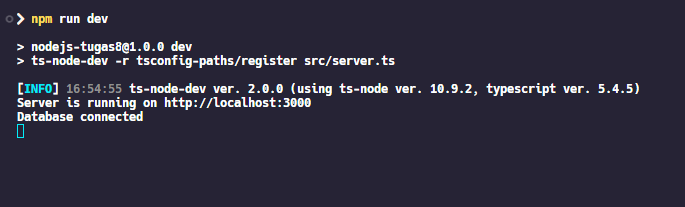

# Tugas 8 Sanbercode MongoDB API - Node.JS Backend

## Muhammad Ridwan Hakim

### Deploy Localhost

```bash
git clone https://github.com/rescenic/nodejs-tugas8.git

cd nodejs-tugas7

npm install

npm run dev
```

### Import Sanbercode MongoDB API.postman_collection.json to Postman

### Screenshots


